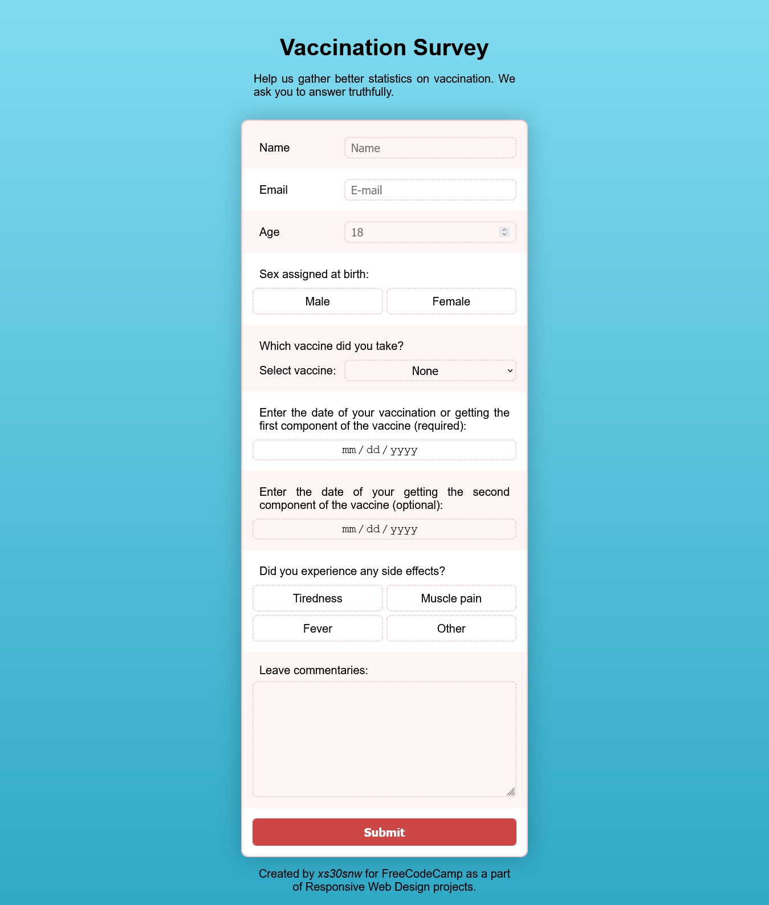

# FreeCodeCamp - Medical Survey

This is a solution to one of the tasks in the Responsive Design Series at [FreeCodeCamp](https://www.freecodecamp.org/learn). The page is built using basic HTML and CSS, flex.

- Live Site URL: [GitHub Pages](https://xs30snw.github.io/FCC_medical-survey/)

## Screenshot

